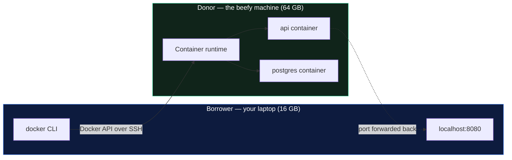
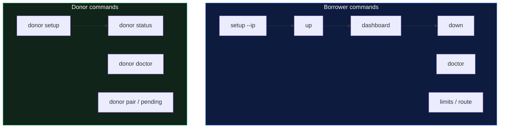
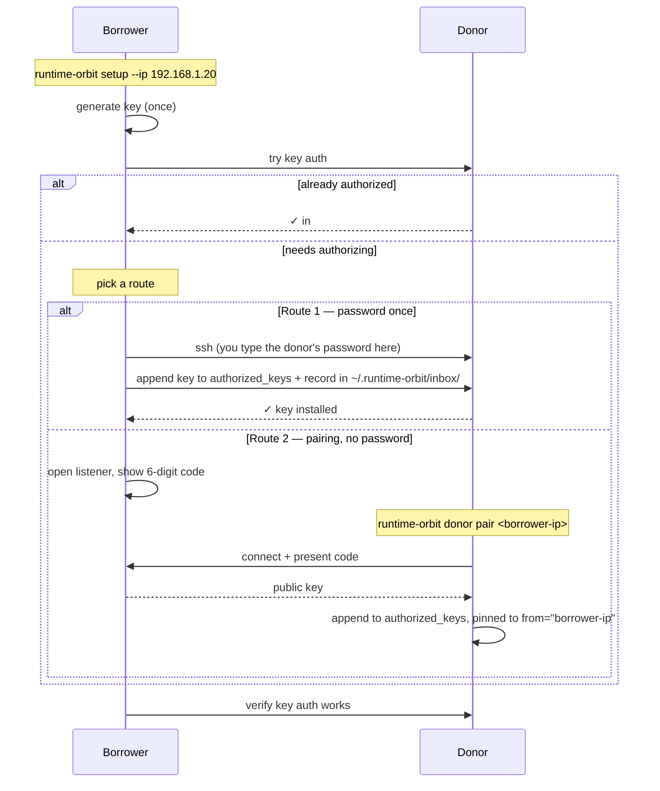
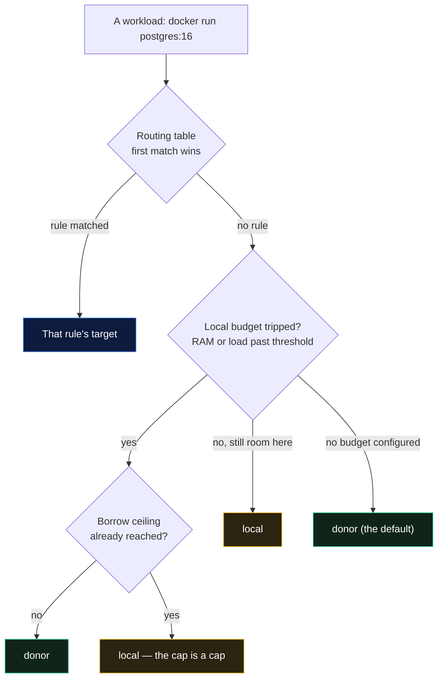
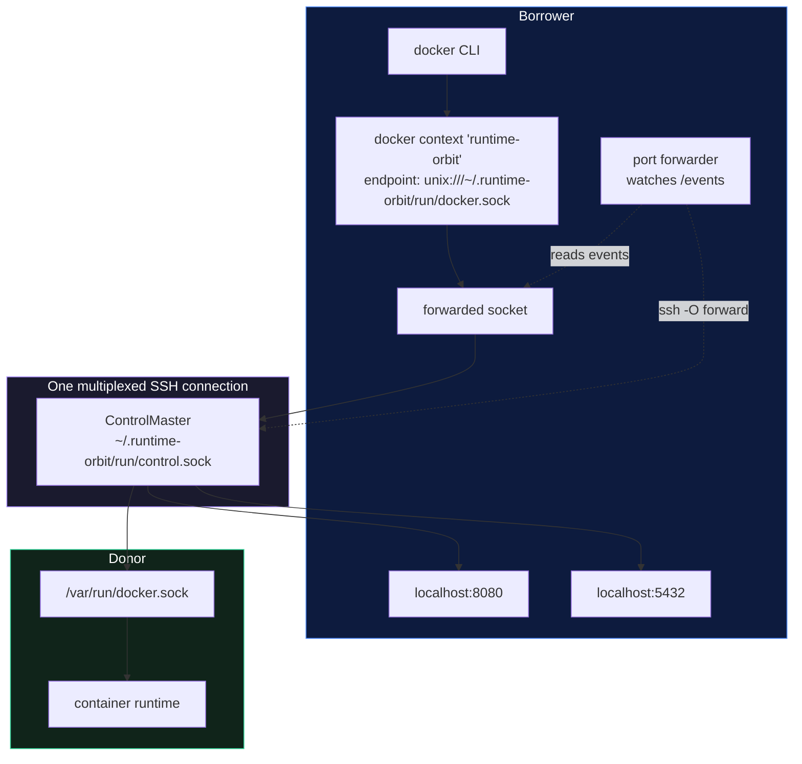
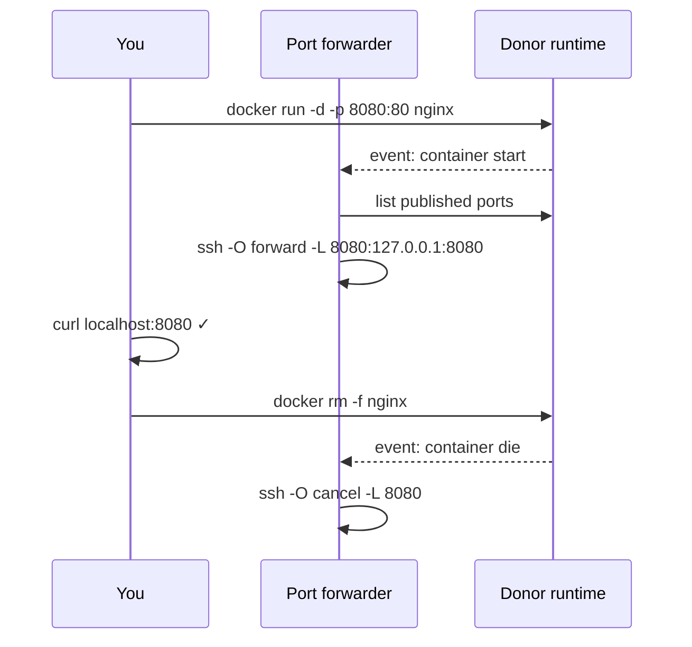

# runtime-orbit — the complete guide

- [What it does](#what-it-does)
- [The two roles](#the-two-roles)
- [Install](#install)
- [Setup, step by step](#setup-step-by-step)
- [How authorization works](#how-authorization-works)
- [Everyday use](#everyday-use)
- [The dashboard](#the-dashboard)
- [Routing: keeping some things local](#routing-keeping-some-things-local)
- [How it works under the hood](#how-it-works-under-the-hood)
- [Running as a service](#running-as-a-service)
- [Supported runtimes](#supported-runtimes)
- [AI assistants (MCP)](#ai-assistants-mcp)
- [Files and config](#files-and-config)
- [Troubleshooting](#troubleshooting)
- [Command reference](#command-reference)

---

## What it does

Docker on a laptop is expensive. A Linux VM, a few containers, a build cache, and
you've spent 8 GB and half your CPU before your editor opens. Meanwhile there's a
machine two metres away with 64 GB doing nothing.

runtime-orbit lends you that machine's container runtime. Your `docker` commands
execute there, and every port you publish comes back to your `localhost`, so
nothing about your workflow changes.



What it is **not**: a code-sync tool, a Kubernetes replacement, or a `docker`
wrapper. Your source stays where it is (bind-mount paths resolve on the donor —
see [Troubleshooting](#troubleshooting)), and runtime-orbit only manages a
standard `docker context`.

---

## The two roles

Every machine plays exactly one of two roles, and the CLI is split the same way.

| | **borrower** | **donor** |
|---|---|---|
| Also called | the laptop, the machine low on RAM | the beefy one, `donator`, `lender` |
| What it needs | the `docker` CLI | a running container runtime + SSH |
| What it runs | `runtime-orbit setup`, `up`, `dashboard`, … | `runtime-orbit donor setup`, `donor status`, … |
| Where containers execute | nowhere — that's the point | here |

Commands with no prefix are borrower commands. Donor commands all live under
`runtime-orbit donor …`.



---

## Install

Install on **both** machines. Same binary, both roles.

**macOS / Linux**

```sh
curl -fsSL https://slothlabs.org/install/runtime-orbit | sh
```

**Homebrew**

```sh
brew install slothlabsorg/tap/runtime-orbit
```

**From source** (needs Rust 1.75+)

```sh
git clone https://github.com/slothlabsorg/runtime-orbit
cd runtime-orbit && cargo install --path .
```

All routes install `runtime-orbit` plus two shortcuts — `r-orbit` and `orbit` —
so `r-orbit dashboard` works, and anyone upgrading from container-orbit keeps
their muscle memory.

**On Windows**, install the Linux binary inside a WSL2 distro. There is no native
Windows build: the transport is a forwarded unix socket, which Windows can't take
part in as a borrower. A WSL2 distro is a perfectly good donor.

Verify:

```sh
runtime-orbit --version
```

---

## Setup, step by step

### 1. On the donor

```sh
runtime-orbit donor setup
```

It will:

1. find the container runtime and its socket;
2. check the SSH server, and **offer to turn it on** (asks for your admin
   password, right there — no separate terminal, no System Settings trip);
3. check whether the machine sleeps, and **offer to stop it** — a sleeping donor
   is the single most common way an overnight build dies;
4. show any pairing requests waiting for approval;
5. print the exact command to run on the other machine, with this machine's IP
   already filled in.

Check it any time with `runtime-orbit donor doctor`:

```
runtime-orbit donor doctor
  [✓] Runtime: OrbStack (/var/run/docker.sock)
  [✓] Runtime API answers (engine 27.4.0)
  [✓] SSH server is listening on port 22
  [✓] 1 runtime-orbit key(s) authorized in ~/.ssh/authorized_keys
  [✓] LAN address: 192.168.1.20
  [✓] Resources: 16 cores · 64.0 GiB RAM (52.1 GiB free) — plenty to lend
  [✓] Sleep settings won't interrupt a borrow

• No issues found! This machine is ready to lend.
```

### 2. On the borrower

```sh
runtime-orbit setup --ip 192.168.1.20
```

Or just `runtime-orbit setup` to scan the LAN and pick from a list. Either way it
authorizes this machine (see below), detects the donor's runtime socket, creates
the `runtime-orbit` docker context, brings the connection up, and runs a real
end-to-end test: nginx on the donor, curled through your localhost.

You can set your budgets in the same breath:

```sh
runtime-orbit setup --ip 192.168.1.20 --max-ram 32 --local-ram-threshold 5
```

### 3. Use docker normally

```sh
docker compose up -d
docker build -t api:dev .
curl localhost:8080
```

---

## How authorization works

Everything happens inside runtime-orbit. You never edit `authorized_keys`, and
you never run `ssh-copy-id`.

The borrower generates an ed25519 key on first run
(`~/.runtime-orbit/keys/id_orbit_ed25519`) and then takes one of two routes.



**Route 1 — the donor's password, once.** runtime-orbit opens the SSH session
with your terminal attached, so the password prompt appears inside the running
command. It then does the `authorized_keys` edit itself, fixes the directory
permissions, and drops a copy of the key in `~/.runtime-orbit/inbox/` on the
donor as a record of who asked.

**Route 2 — pairing, no password at all.** For donors with password login
disabled. The borrower opens a one-shot listener and shows a 6-digit code; on the
donor you run `runtime-orbit donor pair <borrower-ip>` and type the code. The key
travels over the LAN and is authorized with a `from="<borrower-ip>"` restriction,
so it's useless from anywhere else.

The code is a pairing nonce, not a long-lived secret: it's accepted once, the
port is only open while you're pairing, and a wrong code is refused and logged.

**Reviewing later.** `runtime-orbit donor pending` lists every request in the
inbox, marks which are already authorized, and offers to approve the rest.

**Where sudo comes in.** Authorizing a key never needs it — `authorized_keys`
lives in your own home directory. Turning *on* the SSH server and disabling sleep
do, and `runtime-orbit donor setup` asks for your admin password at that moment,
for those two actions only.

---

## Everyday use

```sh
runtime-orbit up            # route docker to the donor (detached)
runtime-orbit status        # one-shot summary
runtime-orbit dashboard     # live view
runtime-orbit down          # back to this machine's engine
```

`up` switches the docker context, opens the SSH connection, and starts the port
forwarder in the background. `down` reverses all three, restoring whichever
context you were on before.

### Ports

Published ports are forwarded automatically, as containers come and go:

```sh
docker run -d -p 8080:80 nginx    # localhost:8080 works immediately
runtime-orbit ports               # list what's forwarded
```

For something not managed by docker — a dev server running natively on the donor:

```sh
runtime-orbit ports add 3000
runtime-orbit ports rm 3000
```

### When something's wrong

```sh
runtime-orbit doctor
```

Every line is a check with a fix attached. It tells you not just that the donor's
socket is missing but which socket the donor *does* have now, and the command to
adopt it.

---

## The dashboard

```sh
runtime-orbit dashboard          # live, refreshing every 2s
runtime-orbit dashboard -n 5     # every 5s
runtime-orbit dashboard --once   # one frame and exit
runtime-orbit dashboard --json   # machine-readable snapshot
```

It shows, side by side:

- **Both machines** — hostname, OS and architecture, LAN IP, cores, a RAM meter
  with used/total, load average, uptime, and which runtime each is using.
- **Routing** — the active docker context and whether it points at the donor, the
  SSH master and forwarder state, and every forwarded port.
- **Borrowed right now** — RAM and CPU the donor is carrying for you, and how many
  containers are on each machine.
- **Containers on the donor** — name, image, CPU%, memory, published ports.
- **Traffic** — container network rates and totals, plus the donor's own NIC
  throughput, computed as deltas between refreshes.
- **Budgets** — meters for your borrow ceiling and local RAM budget, and whether
  new work would currently stay local or go to the donor.
- **The bottom line** — how much RAM and CPU are *not* on this machine, and when
  relevant, that you'd be over your own RAM without the donor.

`--json` returns the same data structured, which is what the MCP server and any
scripting you do should use.

---

## Routing: keeping some things local

By default `up` delegates everything, which is usually what you want. The routing
policy exists for the cases where it isn't.

Two mechanisms, evaluated in this order:



### Budgets

```sh
runtime-orbit limits set --max-ram 32 --local-ram-threshold 5
runtime-orbit limits set --local-load-threshold 4 --prefer auto
runtime-orbit limits set --max-ram off        # remove a limit
runtime-orbit limits show
```

| Setting | Meaning |
|---|---|
| `--max-ram <GB>` | never lean on more than this much donor RAM. Past it, work stays local — a ceiling you can't exceed is the only kind worth having |
| `--local-ram-threshold <GB>` | use this machine until this much of its RAM is in use, then send new work to the donor. A 20 MB alpine container isn't worth a network hop |
| `--local-load-threshold <load>` | same idea, for CPU load average |
| `--prefer auto\|local\|donor` | the tiebreak when nothing else decides. `auto` delegates when no budget is set, and keeps work local when a budget is set but untripped |

### The routing table

```sh
runtime-orbit route add 'postgres:*' --target local --note 'disk latency'
runtime-orbit route add '*redis*'    --target local
runtime-orbit route add '*'          --target donor
runtime-orbit route list
runtime-orbit route rm 2
```

Patterns are globs (`*`, `?`, case-insensitive) matched against the image
reference and container name. First match wins, so add specific rules first —
`route add` warns you when a new rule is shadowed by an existing one and could
never fire.

```
runtime-orbit route list
  #    PATTERN                      TARGET   NOTE
  1    postgres:*                   local    disk latency
  2    *redis*                      local
  3    *                            donor
```

### Using it

```sh
runtime-orbit route explain postgres:16
  workload   postgres:16
  runs on    local (this machine)
  because    rule #1 `postgres:*` → local (disk latency)

runtime-orbit docker run -d postgres:16     # → local
runtime-orbit docker build -t api:dev .     # → donor
```

`runtime-orbit docker …` picks the context and execs the real `docker`, passing
its exit code straight through so `&&` chains and CI behave. Plain `docker` is
untouched and always follows whatever context is active.

---

## How it works under the hood

Three moving parts, and nothing else.



**1. A docker context.** `up` creates and activates a context whose endpoint is a
local unix socket. Because it's a standard context, `docker`, `docker compose`,
Testcontainers, IDE integrations and anything else honouring `DOCKER_HOST` all
follow along with no configuration.

We deliberately *don't* use `ssh://user@host` as the endpoint. That makes docker
run `docker system dial-stdio` on the donor, which needs the `docker` binary on
the donor's non-interactive SSH `PATH` — a common and confusing breakage.
Forwarding the socket avoids the whole class of problem.

**2. One multiplexed SSH connection.** A single `ControlMaster` connection carries
the socket forward and every port tunnel, so there's one authentication and one
TCP connection no matter how many ports you publish.

**3. The port forwarder.** This is what makes it feel local. It connects to the
donor's daemon through the forwarded socket, subscribes to the container event
stream, and reconciles the set of SSH `-L` tunnels against the set of published
ports:



If the event stream drops — an idle timeout, a socket blip — it reconnects with
backoff and keeps existing tunnels in place, so a hiccup never interrupts a
container you're using.

---

## Running as a service

So a reboot doesn't cost you your setup:

```sh
runtime-orbit service install     # launchd (macOS) / systemd --user (Linux)
runtime-orbit service status
runtime-orbit service uninstall
```

The service keeps `up` running and reconnects if the donor reboots or the network
drops. Worth pairing with `donor setup`'s sleep fix on the other side.

---

## Supported runtimes

Anything that speaks the Docker Engine API over a unix socket works, on either
side. runtime-orbit probes for all of these and tells you which it picked:

| Runtime | Socket it looks for |
|---|---|
| Docker Desktop | `/var/run/docker.sock`, `~/.docker/run/docker.sock` |
| OrbStack | `~/.orbstack/run/docker.sock` |
| Rancher Desktop | `~/.rd/docker.sock` |
| colima | `~/.colima/default/docker.sock` |
| Lima | `~/.lima/default/sock/docker.sock` |
| Podman | `~/.local/share/containers/podman/machine/podman.sock`, `/run/podman/podman.sock` |
| containerd | `/run/containerd/containerd.sock` |
| dockerd (Linux) | `/var/run/docker.sock`, `/run/docker.sock` |

```sh
runtime-orbit engines
```

`/var/run/docker.sock` is preferred when present, because most engines symlink it
and it's the most portable choice. Symlinks are resolved, so one engine is never
listed twice, and the generic path is labelled with the product actually behind
it.

Kubernetes is a different layer and out of scope: runtime-orbit moves your
*container runtime*, so a local cluster's containers land on the donor if its
runtime is the one you borrowed.

---

## AI assistants (MCP)

```sh
runtime-orbit mcp
```

Starts an MCP server on stdio. Register it with any MCP client — for Claude Code:

```jsonc
// .mcp.json
{
  "mcpServers": {
    "runtime-orbit": { "command": "runtime-orbit", "args": ["mcp"] }
  }
}
```

18 tools are exposed, including `dashboard` (the full JSON snapshot), `status`,
`up`, `down`, `doctor`, `engines`, `limits_show`, `limits_set`, `route_list`,
`route_add`, `route_explain`, port management, and the donor's `donor_status` /
`donor_doctor`. Interactive setup isn't proxied — `setup_hint` returns the command
for you to run instead, because it may need a password or show a pairing code.

---

## Files and config

Everything lives in `~/.runtime-orbit`:

```
~/.runtime-orbit/
├── config.toml                    # the link, budgets, routing table
├── keys/
│   ├── id_orbit_ed25519           # this machine's key
│   └── id_orbit_ed25519.pub
├── inbox/                         # (donor) pairing requests received
└── run/
    ├── docker.sock                # the forwarded socket
    ├── control.sock               # SSH ControlMaster
    ├── runtime-orbit.pid
    └── runtime-orbit.log
```

Upgrading from container-orbit? A pre-0.2 `~/.orbit` directory is adopted
automatically on first run, keeping your link and key.

`config.toml`:

```toml
donor_user = "dany"
donor_addr = "192.168.1.20"
ssh_port = 22
adapter = "unix"
remote_socket = "/var/run/docker.sock"
context_name = "runtime-orbit"
previous_context = "desktop-linux"

[limits]
max_borrow_ram_gb = 32.0
local_ram_threshold_gb = 5.0
prefer = "auto"

[[routes]]
pattern = "postgres:*"
target = "local"
note = "disk latency"
```

We use `~/.runtime-orbit` rather than the platform config directory on purpose:
macOS's `~/Library/Application Support` contains a space, which is hostile to
unix socket paths in `unix://` endpoints and `ssh -L` specs.

---

## Troubleshooting

Start with `runtime-orbit doctor` on the borrower and `runtime-orbit donor doctor`
on the donor. Between them they check every link in the chain and print a fix for
each failure. Add `-v` (or `-vv`, `-vvv`) to any command to see every SSH and
forwarding action.

**"Cannot SSH to the donor"** — is the donor awake and is its SSH server on? Run
`runtime-orbit donor doctor` there. Then re-run `runtime-orbit setup --ip <ip>`
here; re-authorizing is safe and idempotent.

**The borrow dies overnight.** The donor slept. `runtime-orbit donor setup` will
offer to fix it, or `sudo pmset -a sleep 0 disablesleep 1` on macOS.

**"No runtime running on the donor"** — its engine isn't started, or it moved
sockets (a switch from Docker Desktop to OrbStack does this). `runtime-orbit
engines` shows what's actually there; `runtime-orbit link <user@donor>` adopts the
new socket.

**A published port doesn't answer.** Check `runtime-orbit ports`. If the port is
already in use on the borrower, the tunnel can't bind — the forwarder logs it, so
check `runtime-orbit logs`.

**Bind mounts point at the wrong place.** Paths in `-v /host/path:/in/container`
resolve on the *donor*, since that's where the container runs. Same for build
contexts, which are uploaded and so work as expected. If you need your source
tree inside a container, share the directory to the donor (SMB, NFS, Syncthing)
and mount the donor-side path.

**A Windows donor doesn't forward ports.** Automatic forwarding needs the
runtime's socket reachable over SSH; on Windows it lives inside WSL2, not on the
Windows side. Install the Linux binary in the distro and run `runtime-orbit donor
setup` *there* — it then looks like a normal unix donor. `runtime-orbit doctor`
flags the case explicitly when it sees a Windows donor.

**`docker` still points at the donor after `down`.** `down` restores the context
that was active before `up`. If that context is gone, it falls back to `default`;
`docker context use <name>` sets it explicitly.

---

## Command reference

### Borrower

```
runtime-orbit setup [ADDRESS] [--ip ADDRESS] [--user U] [--port 22]
                    [--max-ram GB] [--local-ram-threshold GB] [--yes] [--no-test]
runtime-orbit doctor
runtime-orbit up [--foreground]
runtime-orbit down
runtime-orbit status
runtime-orbit dashboard [-n SECS] [--once] [--json]
runtime-orbit ports [add PORT | rm PORT]
runtime-orbit engines
runtime-orbit logs [-f] [-n LINES]
runtime-orbit service install | uninstall | status
runtime-orbit pair [--port PORT] [--minutes N]
runtime-orbit link USER@HOST [--port 22] [--socket PATH]
```

### Donor (`donator`, `lender` also work)

```
runtime-orbit donor setup [--iphost IP] [--allow PUBKEY] [--yes]
runtime-orbit donor doctor
runtime-orbit donor status
runtime-orbit donor pair BORROWER_IP [--code CODE] [--port PORT]
runtime-orbit donor pending [--yes]
runtime-orbit donor allow PUBKEY [--iphost IP]
```

### Routing

```
runtime-orbit limits show
runtime-orbit limits set [--max-ram GB|off] [--local-ram-threshold GB|off]
                         [--local-load-threshold LOAD|off] [--prefer auto|local|donor]
runtime-orbit route list
runtime-orbit route add PATTERN --target local|donor [--note TEXT]
runtime-orbit route rm N
runtime-orbit route explain IMAGE
runtime-orbit docker ARGS...
```

### Global flags

```
-v, -vv, -vvv        verbosity (info / debug / trace)
--log-file PATH      also write logs to a file
-h, --help           help for any command
-V, --version        version
```

---

Built with love by [SlothLabs](https://slothlabs.org) — free and open source. If
runtime-orbit saved your laptop, [chipping in](https://slothlabs.org/pricing)
keeps the tools coming. ♥
