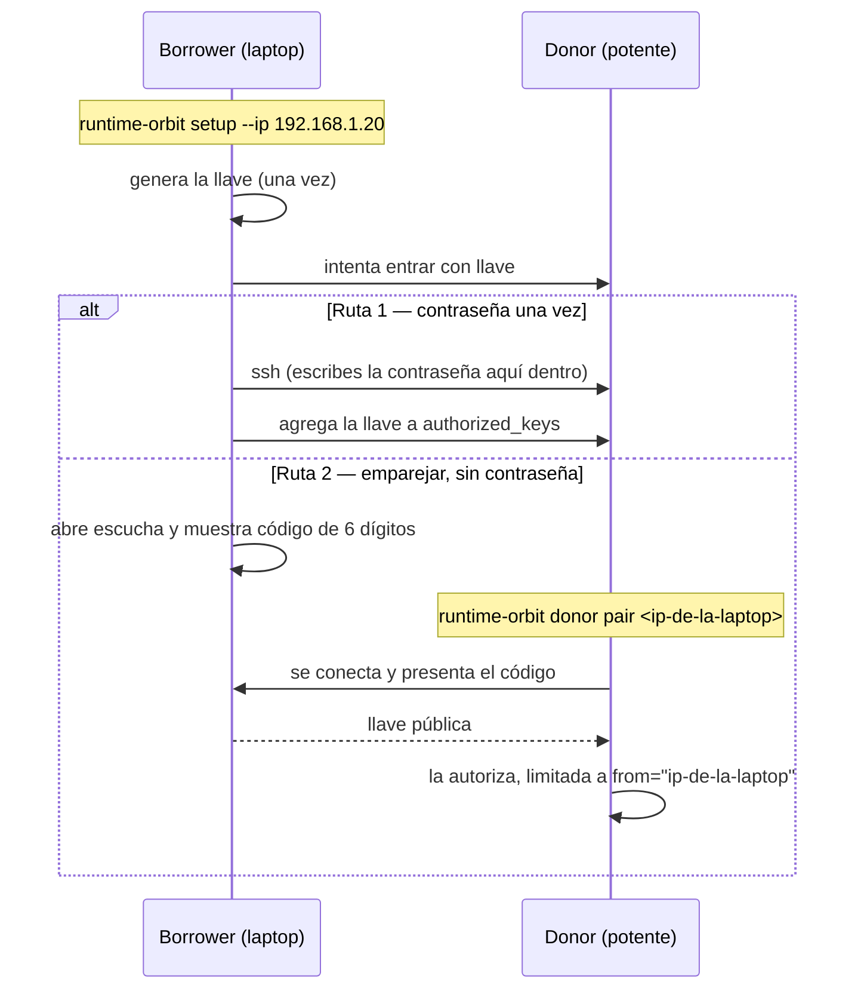

# runtime-orbit — inicio rápido (español)

**Tu laptop se queda sin RAM. La máquina de al lado, no.**

`runtime-orbit` apunta el `docker` de esta máquina al runtime de contenedores de
*otra* máquina por SSH, y devuelve los puertos publicados a tu `localhost`. Los
builds y contenedores pesados corren allá — con su RAM, su CPU y su disco — pero
`docker run -p 8080:80` sigue respondiendo en `localhost:8080` aquí.

La guía completa (en inglés, con diagramas) está en [`GUIDE.md`](GUIDE.md).

## Los dos roles

| Rol | Qué es | Comando |
|---|---|---|
| **borrower** (prestatario) | la máquina con poca RAM — tu laptop | `runtime-orbit setup --ip <ip-del-donor>` |
| **donor** (donador) | la máquina que presta su runtime — la potente | `runtime-orbit donor setup` |

Los comandos sin prefijo son del *borrower*. Los del *donor* van todos bajo
`runtime-orbit donor …` (también funcionan `donator` y `lender`).

## Instalación

En **las dos** máquinas — es el mismo binario para ambos roles.

```sh
# macOS / Linux
curl -fsSL https://slothlabs.org/install/runtime-orbit | sh

# Homebrew
brew install slothlabsorg/tap/runtime-orbit
```

```powershell
# Windows
irm https://slothlabs.org/install/runtime-orbit.ps1 | iex
```

Instala `runtime-orbit` y los atajos `r-orbit` y `orbit`.

## Dos minutos, de principio a fin

**1. En la máquina potente (donor):**

```sh
runtime-orbit donor setup
```

Detecta el runtime, ofrece encender el servidor SSH y evitar que la máquina se
duerma (pide tu contraseña de administrador ahí mismo, para esas dos cosas), y te
imprime el comando exacto para la otra máquina con la IP ya puesta.

**2. En la laptop (borrower):**

```sh
runtime-orbit setup --ip 192.168.1.20
```

Se autoriza sola en el donor — con la contraseña del donor escrita **dentro del
comando**, o con un código de 6 dígitos para no usar contraseña — enlaza, enruta
docker y lo comprueba de verdad: levanta nginx en el donor y lo consulta por tu
localhost.

No hay nada que copiar, pegar ni editar a mano.

**3. Usa docker normal:**

```sh
docker compose up -d
curl localhost:8080
runtime-orbit dashboard     # ver las dos máquinas en vivo
runtime-orbit down          # volver al docker local
```

## Si algo falla

```sh
runtime-orbit doctor          # en la laptop
runtime-orbit donor doctor    # en la máquina potente
```

Cada línea es una comprobación con su arreglo. Agrega `-v`, `-vv` o `-vvv` a
cualquier comando para ver todo lo que hace por dentro.

Las dos causas más comunes:

- **El donor se durmió** — `runtime-orbit donor setup` ofrece arreglarlo.
- **El runtime del donor cambió de socket** (por ejemplo al pasar de Docker
  Desktop a OrbStack) — `runtime-orbit engines` muestra qué hay, y
  `runtime-orbit link <usuario@donor>` adopta el socket nuevo.

## Autorización sin salir de la app



En el donor puedes revisar después lo que llegó:

```sh
runtime-orbit donor pending     # solicitudes esperando aprobación
runtime-orbit donor status      # qué está prestando y a quién
```

## Dejar algunas cosas locales

Por defecto se delega todo, que es lo que suele convenir. Cuando no:

```sh
# presta como máximo 32 GB; usa esta máquina hasta que gaste 5 GB
runtime-orbit limits set --max-ram 32 --local-ram-threshold 5

# la base de datos se queda aquí; lo demás va al donor
runtime-orbit route add 'postgres:*' --target local --note 'latencia de disco'
runtime-orbit route add '*'          --target donor

runtime-orbit route explain postgres:16    # ¿por qué va donde va?
runtime-orbit docker run -d postgres:16    # se queda aquí
runtime-orbit docker build -t api:dev .    # va al donor
```

Las reglas se evalúan de arriba a abajo y gana la primera que coincida. Lo que no
coincide con ninguna cae en los presupuestos de `limits`.

## Detalles que conviene saber

- **Los bind mounts se resuelven en el donor**, porque ahí corre el contenedor. Si
  necesitas tu código dentro de un contenedor, comparte la carpeta al donor (SMB,
  NFS, Syncthing) y monta la ruta del donor. Los contextos de build sí se suben, y
  funcionan sin más.
- **Ambas máquinas en la misma LAN**, y SSH activo en el donor.
- **En la laptop solo necesitas el CLI de `docker`**, no un motor — de eso se trata.
- Funciona con Docker Desktop, OrbStack, Rancher Desktop, colima, Lima, Podman y
  containerd. `runtime-orbit engines` dice cuál escogió en cada lado.

## Que sobreviva a un reinicio

```sh
runtime-orbit service install     # launchd (macOS) / systemd --user (Linux)
```

---

Hecho con cariño por [SlothLabs](https://slothlabs.org) — libre y de código
abierto. Si te salvó la laptop, [apoyar el trabajo](https://slothlabs.org/pricing)
mantiene las herramientas viniendo. ♥
